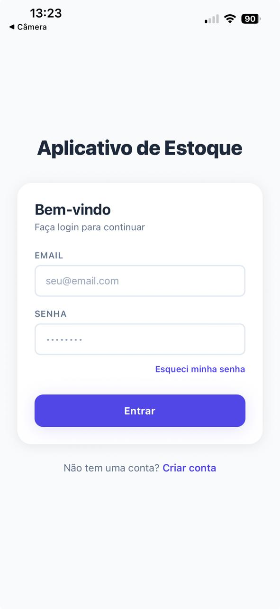
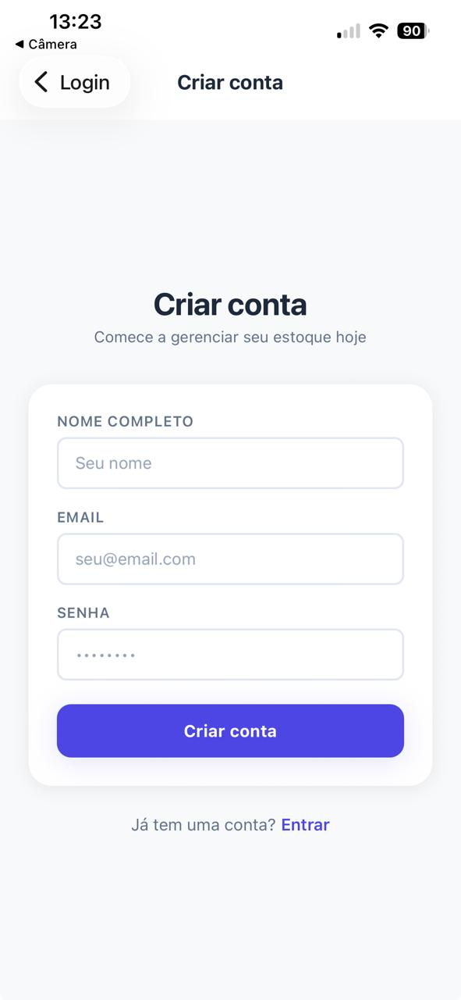
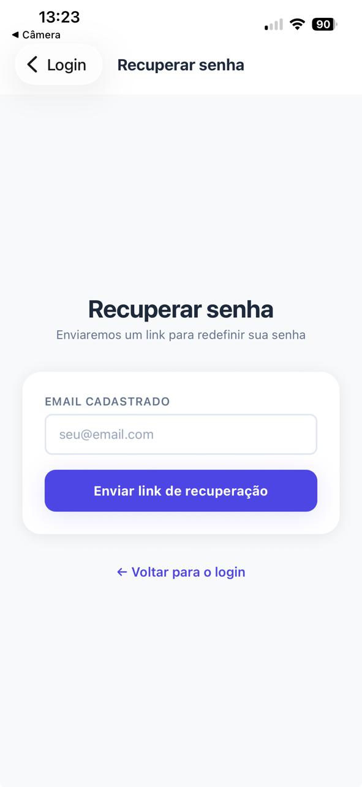
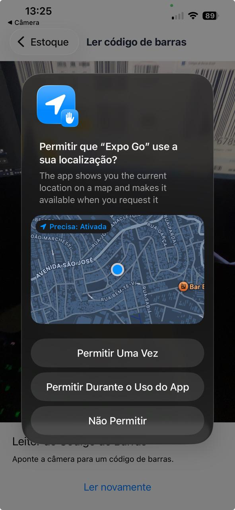
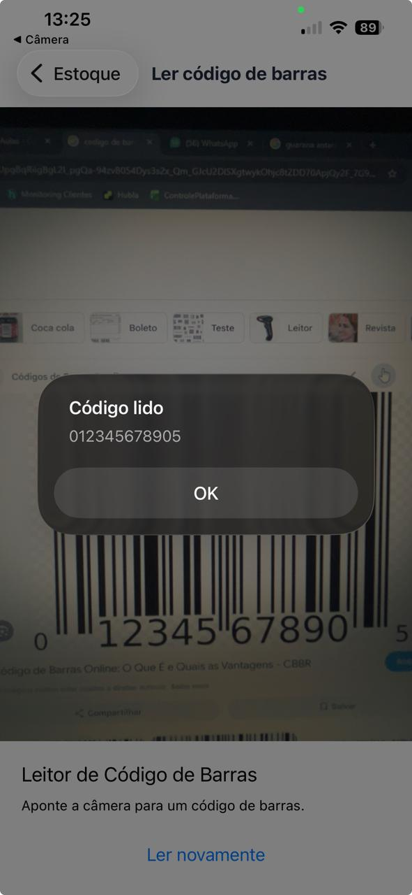
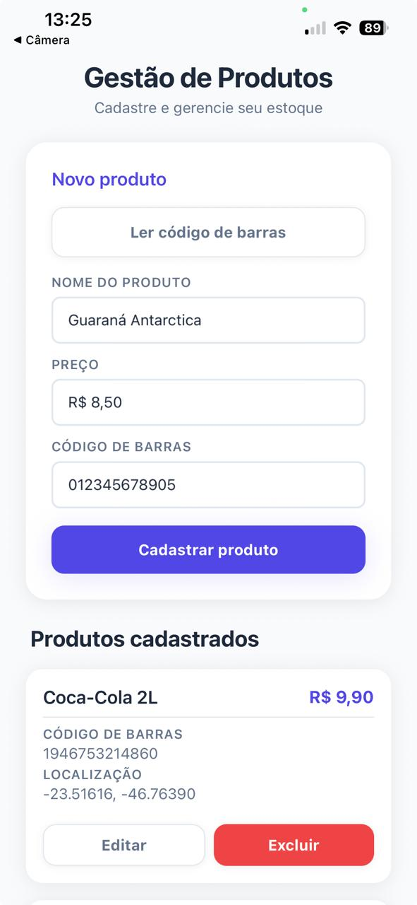
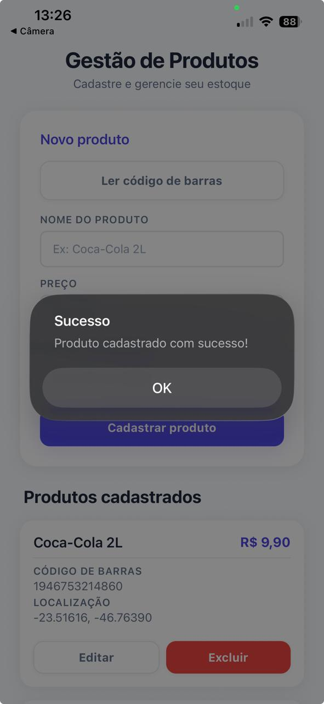
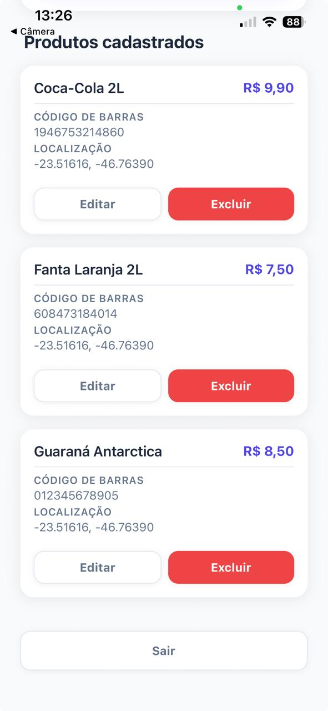

# App de Gestão de Estoque

Aplicativo mobile desenvolvido com **React Native + Expo** para cadastro e gerenciamento de produtos, com leitura de código de barras e captura de localização via GPS.

---

## Identificação

| Campo | Valor |
|-------|-------|
| Turma | 3ESPV |
| Nome  | Léo Kenzo Yamanaka Masago |
| RM    | 557768 |

---

## 🚀 Como rodar o projeto

```bash
# 1. Instalar dependências
npm install
npm install firebase
npx expo install expo-camera expo-location

# 2. Criar o arquivo .env com as variáveis do Firebase
# (veja a seção de configuração abaixo)

# 3. Iniciar o projeto
npx expo start
```

### Variáveis de ambiente necessárias (`.env`)

```env
FIREBASE_API_KEY=
FIREBASE_AUTH_DOMAIN=
FIREBASE_DATABASE_URL=
FIREBASE_PROJECT_ID=
FIREBASE_STORAGE_BUCKET=
FIREBASE_MESSAGING_SENDER_ID=
FIREBASE_APP_ID=
```

---

## Tecnologias utilizadas

- [React Native](https://reactnative.dev/) + [Expo](https://expo.dev/)
- [Firebase](https://firebase.google.com/) — Autenticação e Realtime Database
- [React Navigation](https://reactnavigation.org/) — Navegação entre telas
- [Expo Camera](https://docs.expo.dev/versions/latest/sdk/camera/) — Leitura de código de barras
- [Expo Location](https://docs.expo.dev/versions/latest/sdk/location/) — Captura de GPS

---

## Fluxo de telas

### 1. Login

Tela inicial do aplicativo. O usuário insere email e senha para acessar o sistema. Há atalhos para criar conta e recuperar senha.



---

### 2. Criar conta

Cadastro de novo usuário com nome, email e senha.



---

### 3. Recuperar senha

O usuário informa o email cadastrado e recebe um link de redefinição de senha.



---

### 4. Home — Tela principal

Tela principal com o formulário de cadastro de produtos e a lista de itens cadastrados.


---

### 5. Permissão de localização

Ao cadastrar um produto com o leitor de código de barras, o app solicita permissão para capturar a localização GPS do dispositivo.



---

### 6. Leitura de código de barras

Após a leitura, um alerta exibe o código capturado e a localização é salva automaticamente.



---

### 7. Cadastrando um produto

Formulário preenchido com nome, preço e código de barras do produto antes de salvar. Ao ler código de barras, mantém as informações do nome e do preço do produto.



---

### 8. Confirmação de cadastro

Alerta de sucesso após o produto ser salvo no banco de dados.



---

### 9. Produto cadastrado na lista

O produto aparece na lista com nome, preço, código de barras e localização capturada em latitude e longitude.


